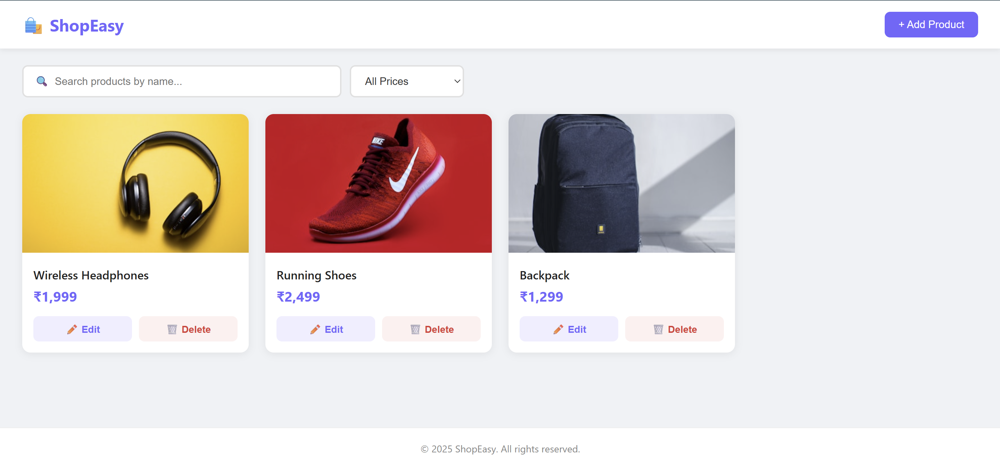

# 🛍️ ShopEasy — E-commerce Mini Application

A full-stack e-commerce application where users can view and manage products.

---

## 🗂️ Project Structure
ecommerce-app/
├── backend/
│   ├── server.js        # Express server + all API routes
│   └── package.json     # Node dependencies
└── frontend/
├── index.html       # Main HTML page
├── style.css        # All styles + responsive design
└── script.js        # Frontend logic + API calls
---

## ⚙️ Setup Instructions

### Prerequisites
- [Node.js](https://nodejs.org/) (v18 or above)
- A modern web browser (Chrome, Firefox, Edge)

### 1. Clone the repository
```bash
git clone https://github.com/YOUR_USERNAME/ecommerce-app.git
cd ecommerce-app
```

### 2. Install backend dependencies
```bash
cd backend
npm install
```

---

## 🚀 How to Run

### Step 1 — Start the backend server
```bash
cd backend
node server.js
```
You should see:
Server running at http://localhost:5000

### Step 2 — Open the frontend
Open `frontend/index.html` directly in your browser.  
(Double-click the file in File Explorer)

> ⚠️ Keep the terminal running while using the app. The backend must stay active.

---

## 🔌 API Endpoints

| Method | Endpoint | Description |
|--------|----------|-------------|
| GET | `/products` | Get all products |
| POST | `/products` | Add a new product |
| PUT | `/products/:id` | Update a product |
| DELETE | `/products/:id` | Delete a product |

---

## ✨ Features

- View all products in a responsive grid
- Add new products via modal form
- Edit existing product details
- Delete products with confirmation
- Search products by name (live filter)
- Filter products by price range
- Empty state when no products exist
- Loading spinner on page load
- Basic form validation (no empty fields, valid price)
- Responsive design (mobile-friendly)

---

## 🛠️ Tech Stack

| Layer | Technology |
|-------|------------|
| Frontend | HTML, CSS, Vanilla JavaScript |
| Backend | Node.js, Express.js |
| Database | In-memory array (no DB required) |

---

## 📸 Screenshots



---

## 👤 Author

**Shaun**  
Assignment submission — Full Stack E-commerce Mini App